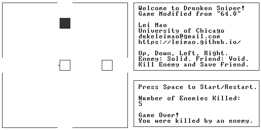
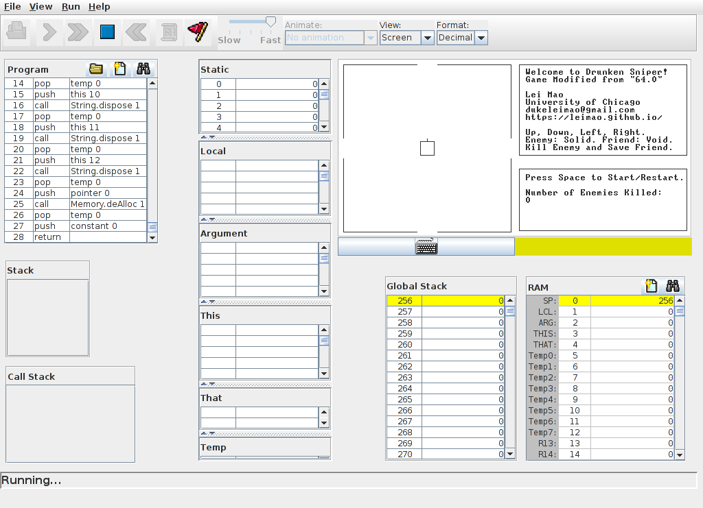

# Drunken Sniper

Lei Mao

University of Chicago

## Introduction

Drunken Sniper is a game modified from the popular idle game [``64.0``](https://store.steampowered.com/app/578850/640/). It was written in Jack Language and built from scratch. It runs on Nand2Tetris's [VM Emulator](https://www.nand2tetris.org/software).


<p align="center">
    
</p>


## Dependencies

* [Nand2Tetris Software Suite Version 2.6](https://www.nand2tetris.org/software)

## Files

```
.
├── nand2tetris
│   └── tools
│       ├── Assembler.bat
│       ├── Assembler.sh
│       ├── bin
│       ├── builtInChips
│       ├── builtInVMCode
│       ├── CPUEmulator.bat
│       ├── CPUEmulator.sh
│       ├── HardwareSimulator.bat
│       ├── HardwareSimulator.sh
│       ├── JackCompiler.bat
│       ├── JackCompiler.sh
│       ├── OS
│       ├── TextComparer.bat
│       ├── TextComparer.sh
│       ├── VMEmulator.bat
│       └── VMEmulator.sh
├── README.md
└── src
    ├── Arena.jack
    ├── Arena.vm
    ├── Arrow.jack
    ├── Arrow.vm
    ├── InfoBoard.jack
    ├── InfoBoard.vm
    ├── Main.jack
    ├── Main.vm
    ├── Player.jack
    ├── Player.vm
    ├── Random.jack
    ├── Random.vm
    ├── ScoreBoard.jack
    ├── ScoreBoard.vm
    ├── Target.jack
    └── Target.vm
```


## Manual

### Controls

#### Start Game

``Space`` 


#### Shoot

``←``, ``→``, ``↑``, ``↓``

### What To Do

Kill enemy and don't kill friend. Enemy is solid box and friend is void box.

### When You Win

You can never actually win. Kill as many enemies as you can!

### When You Lose

You killed a friend, or you were killed by an enemy.

### Recommendation

It is also recommended that you listen to this [song](https://www.youtube.com/watch?v=S92l0x_iFZU) while you are playing.


## Usage

### Compile Game

Use ``JackCompiler`` to compile the source code to vm code.

```bash
./JackCompiler.sh ../../src/
```

### Run Game

Open ``VMEmulator``.

```bash
./VMEmulator.sh
```

In the GUI, load the game by clicking ``File`` -> ``Load Program`` -> select ``src`` folder -> click ``Load Program`` button. Click ``Yes`` on the confirmation message.

<p align="center">
    
</p>

Slide the ``speed`` scroll bar to ``Fast`` and choose ``No animation`` under the ``Animate`` tab.

Click ``Run`` -> ``Run``, or simply just press ``F5`` to run the game.


## References

Here is a list of other games programmed in Jack language.

* [Pacman](https://www.youtube.com/watch?v=uZFkNVWzBWQ)
* [Tetronimo](https://www.youtube.com/watch?v=Z-MRlpnzvJs)
* [Tic Tac Toe](https://www.youtube.com/watch?v=1picbaxgVfA)
* [Mines](https://www.youtube.com/watch?v=SpAAYjXAtJ0)
* [Ну, погоди!](https://www.youtube.com/watch?v=9obkAZ_t-OA)
* [Hackenstein 3D](https://www.youtube.com/watch?v=inFJ5EyOhpM)
* [Bichromia](https://www.youtube.com/watch?v=c-J7lwKWDN8)


## To-Do List

- [ ] Allow users to choose level of difficulties.